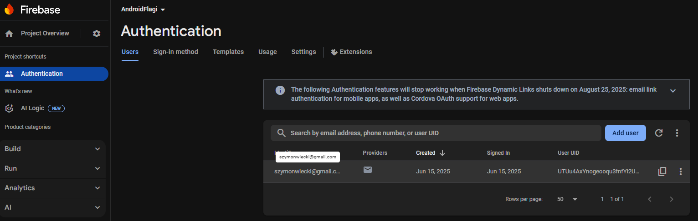

# Projekt android

To prosta aplikacja na Androida, która po pomyślnej autoryzacji użytkownika, umożliwia mu wprowadzanie nazwy kraju i pobieranie jego flagi za pomocą interfejsu API, oraz centruje mapy google na danym kraju.

## Funkcje
- Autoryzacja Firebase email/password
- Wprowadzanie nazwy kraju
- Wyświetlanie flagi kraju za pomocą interfejsu API restcountries
- Centrowanie mapy google na podanym kraju
- Wyświetlanie komunikatów o błędach przy niepoprarawnej rejestracji, logowaniu oraz podaniu nieprawidłowych nazw krajów

## Zrzuty ekranu

## Błędne dane wejściowe przy rejestracji

## Próba zalogowania porzed rejestacją

## Poprawna rejestracja

## Użytkownik widoczny w firebase po rejestracji

## Niepoprawny kraj

## Mexico

## Poland

